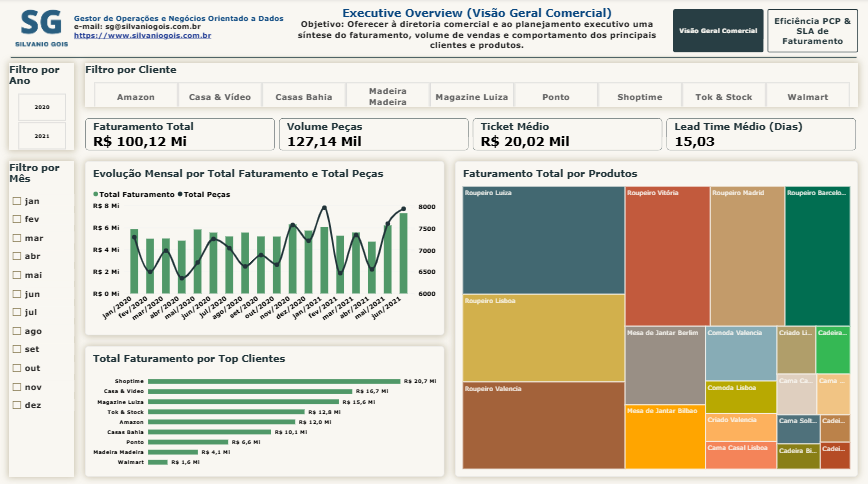
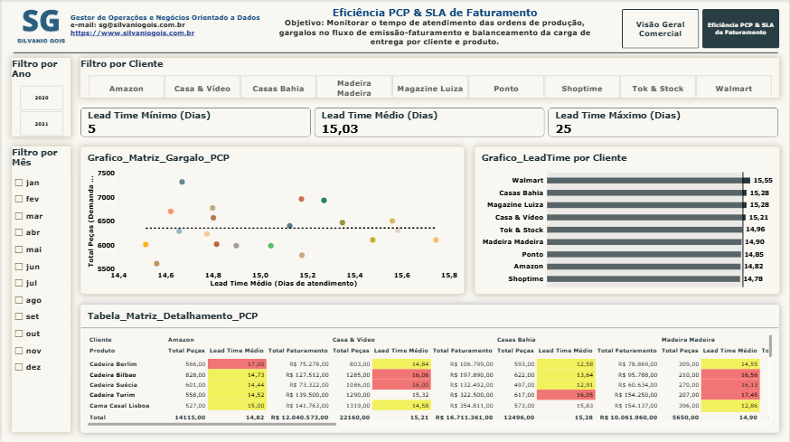

# Dashboard de Integração Comercial & PCP (Planejamento e Controle da Produção)

**Autor:** Silvanio Gois — Gestor de Operações e Negócios Orientado a Dados  
**Acesso ao Dashboard Interativo (Power BI Service):** [Visualizar Painel Online](https://app.powerbi.com/view?r=eyJrIjoiZTcwNzE5NzItMzQ0MC00MjczLTlmYjItOGFjYzg4YWFlNjRhIiwidCI6IjJlYmQyYzU0LWY1ZDMtNGVmYi05ZGE3LWU4Yzk0YmQyMWQzOSJ9)

---

## 1. Visão Geral do Projeto & Objetivo Estratégico

O alinhamento entre a área comercial e o Planejamento e Controle da Produção (PCP) é um dos fatores mais críticos para o sucesso operacional de uma indústria. Vendas sem previsibilidade geram gargalos na fábrica, atrasos nas entregas e aumento do custo operacional; por outro lado, uma produção desconectada da demanda comercial resulta em estoques parados e perda de oportunidade de faturamento.

Este projeto consolida uma solução end-to-end em Business Intelligence que integra a demanda comercial com a capacidade de execução do PCP. Por meio da análise de 5.000 ordens de venda, a ferramenta possibilita:

* Monitorar o faturamento global, volume de peças vendidas e ticket médio por canal de venda e cliente.
* Acompanhar a sazonalidade e evolução das demandas produtivas mês a mês.
* Identificar gargalos operacionais no fluxo de emissão de pedidos e expedição via cálculo de Lead Time.
* Avaliar o Nível de Serviço (SLA) de entrega por produto e cliente, direcionando otimizações no chão de fábrica.

---

## 2. Estrutura do Repositório

```text
├── Comercial+Aplicado+ao+PCP.xlsx        # Base de dados operacional e comercial (5.000 registros)
├── DashboardsDeIntegracaoComercial&PCP.pbix # Arquivo modelo do Power BI Desktop
├── DashboardsDeIntegracaoComercial&PCP.pdf  # Relatório executivo consolidado em PDF
├── pagina1.png                            # Captura de tela: Visão Geral Comercial (Página 1)
├── pagina2.png                            # Captura de tela: Eficiência PCP & SLA de Faturamento (Página 2)
└── README.md                              # Documentação do projeto
```

---

## 3. Análise da Base de Dados de Origem

A base de dados utilizada (`Comercial+Aplicado+ao+PCP.xlsx`) cobre o histórico de operações entre **01/01/2020 e 25/07/2021**, somando 5.000 transações comerciais e produtivas.

### Resumo dos Indicadores Totais da Base
* **Faturamento Total Bruto:** R$ 100.124.300,00
* **Volume de Peças Processadas:** 127.140 unidades
* **Total de Pedidos Únicos:** 5.000 ordens
* **Clientes Ativos:** 9 grandes contas de varejo/e-commerce
* **Produtos Cadastrados:** 20 itens no catálogo de mobiliário
* **Lead Time Médio de Faturamento:** 15,03 dias (com variação entre 5 e 25 dias)

### Dicionário de Atributos da Tabela Fato
| Atributo Original | Tipo de Dado | Classificação | Descrição no Negócio |
| :--- | :--- | :--- | :--- |
| `Pedido` | Inteiro (`Int64`) | Atributo / ID | Identificador único da ordem de venda enviada ao PCP. |
| `Cliente` | Texto (`String`) | Dimensão | Nome do canal/cliente parceiro (ex: Shoptime, Casa & Vídeo). |
| `Produto` | Texto (`String`) | Dimensão | Descrição do produto fabril (ex: Roupeiro Luiza, Cama Casal). |
| `Qtd Vendida` | Inteiro (`Int64`) | Métrica / Fato | Quantidade em peças exigidas para fabricação e entrega. |
| `Valor Total` | Moeda (`Currency`) | Métrica / Fato | Valor bruto negociado no pedido em Reais (R$). |
| `Data Emissão` | Data (`Datetime`) | Temporal | Data em que o pedido foi registrado pela equipe comercial. |
| `Data Faturamento` | Data (`Datetime`) | Temporal | Data da conclusão da produção/faturamento do pedido. |

---

## 4. Arquitetura de Dados, ETL e Modelagem

Para garantir máxima performance analítica e escalabilidade, aplicou-se a arquitetura **Star Schema (Esquema Estrela)** no Power BI.

```
       +-----------------------+
       |     dCalendario       |
       +-----------------------+
       | Date (PK)             |
       | Ano, Mês, Mês/Ano     |
       +-----------+-----------+
                   |
     1             | 1 (Relacionamento Ativo: Data Emissão)
                   | * (Relacionamento Inativo: Data Faturamento)
                   v
       +-----------------------+
       |        fVendas        |
       +-----------------------+
       | Pedido (PK)           |
       | Cliente               |
       | Produto               |
       | Qtd Vendida           |
       | Valor Total           |
       | Data Emissão (FK)     |
       | Data Faturamento (FK) |
       +-----------------------+
```

### Processo de ETL (Power Query)
1. **Limpeza e Higienização:** Remoção de colunas nulas resultantes da exportação original.
2. **Tipagem Estrita:** Ajuste manual de todos os tipos primitivos (datas, moedas e valores inteiros).
3. **Criação da Tabela Dimensão Temporal (`dCalendario`):** Gerada em código DAX para cobrir de forma contínua a menor data de emissão e a maior data de faturamento da basefato.

```dax
dCalendario = 
VAR _DataMin = MIN(fVendas[Data Emissão])
VAR _DataMax = MAX(fVendas[Data Faturamento])
RETURN
ADDCOLUMNS(
    CALENDAR(_DataMin, _DataMax),
    "Ano", YEAR([Date]),
    "Mês Num", MONTH([Date]),
    "Mês", FORMAT([Date], "mmm"),
    "Mês/Ano", FORMAT([Date], "mmm/yyyy"),
    "ClassificacaoAnoMes", YEAR([Date]) * 100 + MONTH([Date]),
    "Trimestre", "T" & FORMAT([Date], "q"),
    "Dia da Semana", FORMAT([Date], "dddd")
)
```

---

## 5. Dicionário de Medidas DAX

Todas as medidas foram centralizadas em uma tabela dedicada (`_Medidas`).

### Medidas de Faturamento e Volume Comercial
* **Total Faturamento:**
  $$\text{Total Faturamento} = \sum (\text{fVendas}[Valor Total])$$
  ```dax
  Total Faturamento = SUM(fVendas[Valor Total])
  ```

* **Total Peças:**
  $$\text{Total Peças} = \sum (\text{fVendas}[Qtd Vendida])$$
  ```dax
  Total Peças = SUM(fVendas[Qtd Vendida])
  ```

* **Total Pedidos:**
  ```dax
  Total Pedidos = DISTINCTCOUNT(fVendas[Pedido])
  ```

* **Ticket Médio por Pedido:**
  ```dax
  Ticket Médio = DIVIDE([Total Faturamento], [Total Pedidos], 0)
  ```

### Medidas de Performance Operacional e PCP (SLA / Lead Time)
* **Lead Time Médio (Dias):** Tempo decorrido em dias corridos entre o pedido comercial e o faturamento produtivo.
  ```dax
  Lead Time Médio = 
  AVERAGEX(
      fVendas,
      DATEDIFF(fVendas[Data Emissão], fVendas[Data Faturamento], DAY)
  )
  ```

* **Lead Time Mínimo:**
  ```dax
  Lead Time Mínimo = MINX(fVendas, DATEDIFF(fVendas[Data Emissão], fVendas[Data Faturamento], DAY))
  ```

* **Lead Time Máximo:**
  ```dax
  Lead Time Máximo = MAXX(fVendas, DATEDIFF(fVendas[Data Emissão], fVendas[Data Faturamento], DAY))
  ```

---

## 6. Estrutura dos Dashboards e Relatório Visual

### Página 1: Executive Overview (Visão Geral Comercial)
Oferece à alta gestão e ao planejamento estratégico a consolidação de vendas, receita e comportamento do mix de produtos e carteira de clientes.



#### Componentes e Estrutura da Página 1:
1. **Painel Superior de Filtros:** Slicers interativos por Ano, Mês e Seleção Dinâmica por Cliente.
2. **KPI Cards:**
   * `Faturamento Total`: R$ 100,12 Mi
   * `Volume Peças`: 127,14 Mil
   * `Ticket Médio`: R$ 20,02 Mil
   * `Lead Time Médio`: 15,03 Dias
3. **Evolução Mensal (Gráfico Combinado - Colunas e Linhas):** Eixo temporal com faturamento bruto em colunas e total de peças em linha contínua, permitindo avaliar momentos de pico de produção.
4. **Faturamento Total por Top Clientes (Gráfico de Barras Horizontais):** Ranking de receita acumulada por cliente, destacando a liderança da conta *Shoptime* (R$ 20,7 Mi) e *Casa & Vídeo* (R$ 16,7 Mi).
5. **Mix de Produtos por Faturamento (Treemap):** Distribuição proporcional de receita do catálogo fabril, onde os modelos *Roupeiro Luiza*, *Roupeiro Vitória*, *Roupeiro Madrid* e *Roupeiro Lisboa* concentram a maior fatia do volume de produção.

---

### Página 2: Eficiência PCP & SLA de Faturamento
Desenvolvida para a equipe de Planejamento e Controle da Produção acompanhar o tempo de ciclo, gargalos de expedição e equilibrar o balanceamento de ordens.



#### Componentes e Estrutura da Página 2:
1. **KPI Cards de SLA Operacional:**
   * `Lead Time Mínimo`: 5 Dias
   * `Lead Time Médio`: 15,03 Dias
   * `Lead Time Máximo`: 25 Dias
2. **Gráfico de Dispersão (Matriz de Gargalos PCP):**
   * **Eixo X:** Lead Time Médio (Dias de atendimento)
   * **Eixo Y:** Total Peças (Demanda produtiva)
   * **Tamanho da Bolha:** Total Faturamento
   * **Finalidade:** Mapear produtos de alto volume com alto tempo de atravessamento na fábrica.
3. **Lead Time Médio por Cliente (Gráfico de Barras Horizontais):** Comparativo do tempo médio de atendimento para cada parceiro comercial, evidenciando estabilidade operacional com variação entre 14,78 e 15,55 dias.
4. **Matriz de Detalhamento Produto x Cliente (Tabela Matriz):**
   * **Linhas:** Produto
   * **Colunas:** Cliente
   * **Métricas Exibidas:** Total Peças, Lead Time Médio e Total Faturamento
   * **Formatação Condicional (Gradiente SLA):**
     * Verde: SLA rápido (Lead Time $\le 13$ dias)
     * Amarelo: SLA dentro da média ($\sim 15$ dias)
     * Vermelho: SLA crítico (Lead Time $\ge 16$ dias)

---

## 7. Principais Insights de Negócio & Tomada de Decisão

1. **Concentração de Receita em Top Accounts:** Os 3 maiores clientes (*Shoptime*, *Casa & Vídeo* e *Magazine Luiza*) representam juntos mais de **52% do faturamento total**. Estratégia de produção e lotes de expedição devem priorizar a manutenção dos SLAs dessas contas.
2. **Estabilidade no Ciclo Produtivo (SLA Geral):** O Lead Time Médio geral permanece estabilizado em 15 dias, demonstrando padronização no fluxo fabril.
3. **Mapeamento de Gargalos por Matriz de Calor:** Através da matriz condicional na Página 2, identifica-se que combinações específicas como *Cadeira Berlim* para o cliente *Amazon* atingem **17,00 dias de Lead Time** (alerta vermelho), demandando revisão no sequenciamento de lote ou disponibilidade de insumos.

---

## 8. Como Executar o Projeto Localmente

### Pré-requisitos
* Microsoft Power BI Desktop instalado (versão recente).
* Microsoft Excel ou compatível.

### Passo a Passo
1. Clone este repositório para o seu ambiente local:
   ```bash
   git clone https://github.com/SilvanioSG/Integracao-Comercial-PCP-PowerBI.git
   ```
2. Abra a pasta do projeto.
3. Certifique-se de que o arquivo `Comercial+Aplicado+ao+PCP.xlsx` está no mesmo diretório.
4. Abra o arquivo `DashboardsDeIntegracaoComercial&PCP.pbix` no Power BI Desktop.
5. Caso o Power BI solicite atualização do caminho dos dados, acesse **Transformar Dados > Configurações da Fonte de Dados** e selecione o caminho local do arquivo Excel.

---

## 9. Contato e Informações Profissionais

**Silvanio Gois**  
*Gestor de Operações e Negócios Orientado a Dados*

* **Website Profissional:** [silvaniogois.com.br](https://www.silvaniogois.com.br)
* **LinkedIn:** [linkedin.com/in/silvanio-gois](https://www.linkedin.com/in/silvanio-gois/)
* **GitHub:** [github.com/SilvanioSG](https://github.com/SilvanioSG)
* **E-mail:** [sg@silvaniogois.com.br](mailto:sg@silvaniogois.com.br)